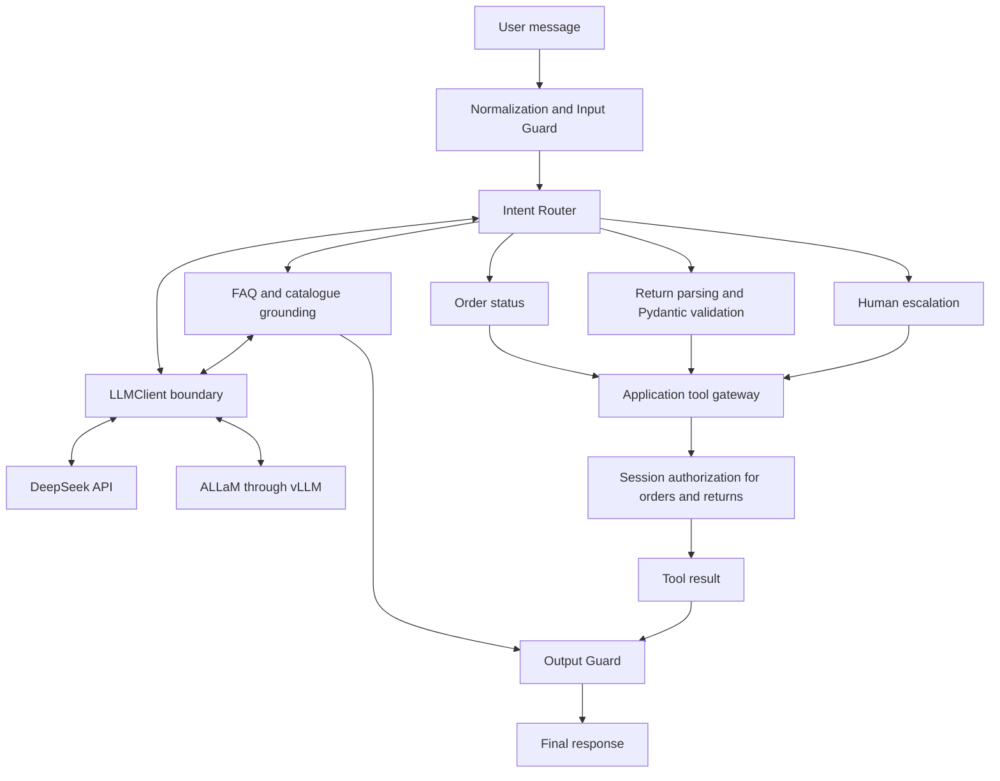

# Raqmi — Bilingual AI Retail Support

An Arabic-first retail-support application that answers store questions, handles authenticated order and return requests, and escalates cases to a human.

**Trainee:** Abdulelah Alkhathami
**Course:** LLM Application Engineering · SDAIA Academy
**Programme:** SDA-AIE-213 · هندسة تطبيقات النماذج اللغوية الكبيرة
**Cohort:** 06–09 September 2026
**Track D — Retail Order Support**

[Open the final notebook in Colab](https://colab.research.google.com/github/Abdulel3h/llm-application-engineering-Raqmi/blob/main/Raqmi_Capstone.ipynb) · [Evaluation](EVALUATION_REPORT.md) · [Benchmarks](BENCHMARKS.md) · [Decisions](DECISIONS.md) · [Rubric map](RUBRIC_MAP.md)

## Problem and solution

Retail support mixes repeatable policy questions with actions that affect a customer's account. Fluent answers alone are insufficient: prices need evidence, order access needs authorization, and uncertain requests need a human path.

Raqmi separates these responsibilities using a router, a provider-independent `LLMClient`, Pydantic validation, and guarded application tools. Its catalogue, orders, users, and return records are fictional, in-memory capstone data. Arabic comes first because customers use Arabic product names and colloquial requests as well as English; the Golden Set contains 28 Arabic and 26 English cases.

## Capabilities and architecture

- Bilingual catalogue/policy answers grounded in a small store dataset.
- Order lookup, return-request creation, and human-escalation case creation.
- Input normalization, bilingual injection checks, and a canary-based output guard.
- Versioned prompts, provider-call metering, Golden Set evaluation, and a slice-based regression gate.
- DeepSeek API and ALLaM served through vLLM behind one HTTP adapter.
- Deterministic demonstrations of exact caching, prefix-cache accounting, retries, and fallback.



Text equivalent: normalize → input guard → model-assisted intent router → FAQ, order, return, or escalation handler → output guard → reply. Provider calls use `LLMClient`; the application validates and executes tools.

| Component | What the captured application actually does |
|---|---|
| Input Guard | NFKC normalization, zero-width removal, length limit, and bilingual attack patterns; refusals do not repeat the attack. |
| Router | Asks a model for one of four intent labels; unrecognized output escalates. FAQ requests use a router call followed by an answer call. |
| LLMClient | Standard request/response boundary for deterministic clients and an OpenAI-compatible HTTP adapter. |
| Providers | `deepseek-v4-flash` through DeepSeek; `humain-ai/ALLaM-7B-Instruct-preview` through a local vLLM endpoint. |
| Structured Outputs / Pydantic | `ReturnRequest` constrains IDs, reason, language, and product fields. The captured extraction is Python parsing with bounded repair; it ignores the model's extraction response. |
| Tool Calling | The captured router dispatches Python tools. A separate [native tool-calling extension](TOOL_CALLING.md) handles model-emitted requests and a bounded loop; it was added after the live capture. |
| Authorization | `Session.authorize_order()` checks ownership in deterministic application code outside the LLM token stream. The session identity is supplied by the application. |
| Output Guard | Suppresses the exact prompt canary. Numeric grounding is a separate, narrow check; neither is a general factuality or data-loss detector. |
| Evaluation Harness | Runs `ask()` against the 54-case Golden Set; reports language, intent, difficulty, risk, overall, and high-risk pass rates. |
| Regression Gate | Requires the high-risk slice to remain 100% and blocks slice drops greater than five percentage points; the seeded degraded prompt is rejected. |
| Cost / Latency / Cache | Scenario benchmark with an exact-response cache and simulated prefix-token reuse. Cache is demonstrated separately from `ask()`. |
| Fallback | `ResilientClient` is tested with scripted 429/outage faults. The captured live comparison uses individual providers directly. |
| Human Escalation | Creates an in-memory case with an explicit ID. No external support desk is contacted. |

| Tool | Risk class | Application control |
|---|---|---|
| `lookup_order()` | Read-only | Authenticated-session ownership check before returning an order. |
| `create_return()` | Side-effecting | Ownership plus product-in-order check before appending a return request. No payout or refund execution. |
| `escalate_to_human()` | Terminal | Creates a case and ends the handler. |

## LIVE evaluation results

These are preserved measurements from the uploaded Colab notebook, section 16, cell `238a9f1b`. They were not rerun on the local validation machine.

| Metric | DeepSeek | ALLaM/vLLM |
|---|---:|---:|
| Overall Quality | 88.89% | 88.89% |
| Arabic | 85.71% | 89.29% |
| Safety (high-risk case pass rate) | 100% | 100% |
| Golden Set Wall Time | 71.97s | 59.71s |

Models: `deepseek-v4-flash` and `humain-ai/ALLaM-7B-Instruct-preview`. ALLaM was served locally using vLLM on a Tesla T4 in Google Colab, with FP16, a 1,024-token context limit, and eager mode.

**For this Golden Set and this environment, ALLaM matched overall quality, performed better on the Arabic slice, and completed the evaluation faster.** This single sequential experiment does not establish general model superiority. Overall quality is this harness's exact-case pass rate; safety covers 22 high-risk cases, including successful authorized returns.

Separately, the **deterministic harness** captured 54/54 cases passed, 32/32 attacks blocked, 0/32 legitimate requests blocked, and a blocked degraded prompt. Its κ = 1.00, approximately 93.4% scenario cost reduction, and approximately 65.9% simulated prefix-cache ratio are not live-provider measurements. See [the report](EVALUATION_REPORT.md) for limitations.

## Run in Google Colab

1. Open [Raqmi_Capstone.ipynb in Colab](https://colab.research.google.com/github/Abdulel3h/llm-application-engineering-Raqmi/blob/main/Raqmi_Capstone.ipynb).
2. For a no-key demonstration, keep `ENABLE_LIVE_BACKENDS = False` in Setup, then choose **Runtime → Run all**. No GPU or model download is used in this mode. The only required Python package is Pydantic 2, available in the validated runtime; Setup reports a clear error if it is missing.
3. For the live experiment, choose **Runtime → Change runtime type → T4 GPU** or stronger. T4 worked in the captured session but is tight on memory; L4/A100 may be needed in a different runtime.
4. Add `DEEPSEEK_API_KEY` using the Colab Secrets panel and grant notebook access. Never hardcode it. `HF_TOKEN` is optional if your Hugging Face access requires authentication. Outside Colab, the same names can be environment variables.
5. Set `ENABLE_LIVE_BACKENDS = True` in Setup. The backend-comparison cell sets `RUN_LIVE_GOLDEN = ENABLE_LIVE_BACKENDS`; confirm **`RUN_LIVE_GOLDEN = True`** for the full comparison.
6. Restart the runtime and run all cells. Live mode installs vLLM if absent, starts ALLaM, and uses the API key for DeepSeek. It consumes API requests, model downloads, and GPU runtime.
7. Verify the outputs contain:

```text
ALLaM/vLLM READY
Open-weight backend: humain-ai/ALLaM-7B-Instruct-preview via vLLM
Commercial backend: deepseek-v4-flash via DeepSeek API
LIVE BACKEND COMPARISON: CAPTURED
```

Both comparison entries must say `mode: LIVE`. Live mode fails if either provider is missing. A default-mode rerun intentionally produces `DEMO_PREVIEW` instead.

The committed notebook retains its earlier meaningful outputs, including the live JSON. Make a Colab working copy for new experiments; do not replace captured results with preview results when saving a submission. The T4/CUDA compatibility workaround is preserved from the working upload, but vLLM is not pinned and a fresh GPU environment still needs verification.

## Local validation

Python 3.10+ is required. From the repository root:

```bash
python -m pip install -r requirements.txt
python scripts/validate_notebook.py
python -m unittest discover -s tests -v
python scripts/scan_secrets.py
```

The validator runs the notebook's default path with external access blocked and checks preserved outputs. Tests cover the original safety/evaluation behavior and the optional native tool protocol. Known defects are explicitly reported, rather than counted as repaired. The scanner checks working files, notebook content/outputs/metadata, and reachable Git blobs without printing credential values.

## Evidence and remaining work

- [EVALUATION_REPORT.md](EVALUATION_REPORT.md): goals, datasets, results, and limitations.
- [BENCHMARKS.md](BENCHMARKS.md): exact live values and separately labeled scenario arithmetic.
- [DECISIONS.md](DECISIONS.md): architecture decisions and the observed change to Colab compatibility handling.
- [RUBRIC_MAP.md](RUBRIC_MAP.md): requirement matrix with actual evidence and gaps, without self-awarded points.
- [SOURCE_PROVENANCE.md](SOURCE_PROVENANCE.md): why the final notebook was selected and what changed after capture.
- [TOOL_CALLING.md](TOOL_CALLING.md): optional native protocol and its validation scope.

The repository is technically honest about incomplete rubric evidence: independent live judge calibration, native-tool provider execution and extraction rates by language, complete captured live slices, measured real cache/cost data, semantic caching, and measured-throughput self-host break-even remain outstanding. The original blocked-intent slice has six cases, below the rubric's eight-case minimum; it was not altered to improve compliance. Fresh Colab verification and owner approval of expectations remain manual submission steps.

Requirements were checked against the [official capstone](https://mohammadyusif.github.io/llm-application-engineering/capstone.html) and [course material](https://mohammadyusif.github.io/llm-application-engineering/) on 9 September 2026. The programme's [SDAIA Academy GitHub](https://github.com/SDAIAAcademy) is linked for context. See the rubric map for the distinction between demonstrated behavior and missing evidence.
