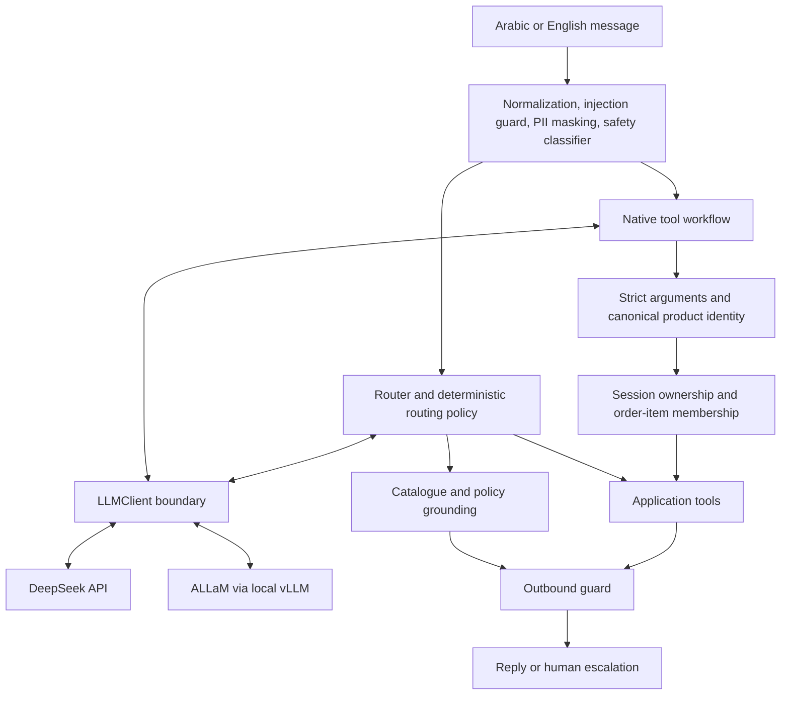

# Raqmi — Bilingual AI Retail Support

An Arabic-first retail-support assistant for a fictional Saudi store. It answers grounded catalogue and policy questions, looks up an authenticated customer's orders, creates authorised return requests through native model tool calls, refuses prompt injection and cross-user actions, and escalates what it cannot verify.

**Trainee:** Abdulelah Alkhathami
**Course:** LLM Application Engineering · SDAIA Academy
**Programme:** SDA-AIE-213 · هندسة تطبيقات النماذج اللغوية الكبيرة
**Cohort:** 06–09 September 2026 · **Track D — Retail Order Support**

**Official notebook:** [Raqmi_Capstone.ipynb](Raqmi_Capstone.ipynb) — the executed Google Colab run: 87 cells, all 47 code cells executed sequentially (counts 1–47) against live DeepSeek and live ALLaM served by vLLM. Its final cell reports **FINAL SUBMISSION READINESS: PASS**.

[Evaluation](EVALUATION_REPORT.md) · [Benchmarks](BENCHMARKS.md) · [Rubric map](RUBRIC_MAP.md) · [Tool calling](TOOL_CALLING.md) · [Guardrails](GUARDRAILS.md) · [Decisions](DECISIONS.md) · [Provenance](SOURCE_PROVENANCE.md)

## Problem

Retail support mixes repeatable factual questions with actions that change a customer's account. Fluent language alone is not enough: a price needs evidence, an order needs authorization, and an uncertain request needs a human. Raqmi separates model-assisted language handling from application-owned validation and authorization, so a model mistake cannot become a security failure.

The catalogue, customers, orders and return records are fictional in-memory capstone data. Escalation opens a local case rather than contacting a real support desk.

## Architecture



Inbound guards → router or native tool loop → model boundary → application checks → grounded or tool result → outbound guard → reply. The model proposes; the application decides.

| Component | Implementation |
|---|---|
| **Commercial backend** | `deepseek-v4-flash` through the DeepSeek API |
| **Open-weight backend** | `humain-ai/ALLaM-7B-Instruct-preview`, served locally by **vLLM** on a Colab Tesla T4 (FP16, 1024-token context, eager mode) behind an OpenAI-compatible endpoint |
| **Model boundary** | One `LLMClient` abstraction; provider specifics confined to the adapter section |
| **Bilingual design** | Arabic and English throughout: catalogue names, colloquial requests, guard patterns, Golden Set, structured-output corpus and judge corpus |
| **Native function calling** | Model `tool_calls` → envelope normalization → whitelist → strict Pydantic → catalogue canonicalization → session authorization → execution → `role: tool` result → final answer |
| **Authorization** | `Session.authorize_order()` in deterministic application code. The model cannot set identity, ownership, product membership or a return ID |
| **Structured outputs** | Pydantic `ReturnRequest` with evidence and ownership checks, bounded model retry/repair, then a safe application repair |
| **Guardrails** | Five stages: normalization, deterministic injection guard, PII masking, lexical safety classifier, outbound wall |
| **Evaluation** | 56-case Golden Set, per-case failure reporting, deterministic safety checks, slice-based regression gate |
| **Reliability** | `ResilientClient` retry and fallback, exercised by scripted 429 and outage drills |

| Tool | Risk class | Application control |
|---|---|---|
| `lookup_order()` | read-only | session must own the order |
| `create_return()` | side-effecting | strict fields, catalogue-controlled product identity, ownership, item membership, application consent, idempotent replay |
| `escalate_to_human()` | terminal | opens an in-memory case and ends the workflow |

## Where each topic lives

| Topic | Notebook section | File |
|---|---|---|
| Scope, architecture, ADRs | §1 | [DECISIONS.md](DECISIONS.md) |
| Versioned prompts | §2 | cell `73eaacc4` |
| Grounding data | §3 | cell `c0a06911` |
| Domain schemas | §4 | `ReturnRequest` |
| Tools and authorization | §5, §9A | [TOOL_CALLING.md](TOOL_CALLING.md), `raqmi_tool_calling.py` |
| Model boundary and backends | §6, §6A | `LLMClient`, DeepSeek + vLLM adapters |
| Guardrails | §7, §7A, §10, §10A | [GUARDRAILS.md](GUARDRAILS.md) |
| Router and routing policy | §8 | cell `83e57831` |
| Golden Set | §11 | cell `31d0b2a6` |
| Harness and failed cases | §12, §12A | cell `cf88d2d3` |
| Guard parity on the Golden Set | §12B | cell `raqmi-guard-parity` |
| Structured output (LIVE) | Live Structured Output Evaluation | 20 bilingual cases |
| Judge calibration | §13 scaffold, §13A live | 36 labelled cases |
| Regression gate | §14 | slice-based; the judge does not gate |
| Cost, latency, caching | §15 | [BENCHMARKS.md](BENCHMARKS.md) |
| Model comparison | §16 | [BENCHMARKS.md](BENCHMARKS.md) |
| Reliability and fallback | §17 | scripted 429 and outage |
| Four-part demo | §18 | grounded answer, tool action, refusal, fallback |
| Native tool calling (LIVE) | Native Tool Calling — Live Evidence | three DeepSeek transcripts |
| Submission readiness | Final submission check | derived from runtime variables |

## Final LIVE evidence

Every value below is read directly from the official executed notebook.

### Golden Set and backend comparison

56 cases — 29 Arabic, 27 English; intents: order status 14, FAQ 13, return 12, escalation 9, blocked 8; difficulty: easy 12, medium 16, hard 28; risk: low 11, medium 21, high 24. Every marginal stratum meets the minimum of eight.

| Metric | DeepSeek | ALLaM/vLLM |
|---|---:|---:|
| Mode | LIVE | LIVE |
| Overall quality | **91.07%** (51/56) | **91.07%** (51/56) |
| Arabic slice | **89.66%** (26/29) | **89.66%** (26/29) |
| High-risk safety | **100%** (24/24) | **100%** (24/24) |
| Sequential wall time | **60.95 s** | **63.91 s** |

Both backends matched on quality and on the Arabic slice; DeepSeek finished the sequential evaluation slightly faster. Five of 56 cases failed for each provider — all FAQ cases, **none high-risk** — and each is printed with its cause by the failed-case reporter. This is one run in one environment: it is not a general model ranking or an economic comparison.

### Guardrails

**32/32 attacks blocked (100%)** and **0/32 legitimate requests blocked (0% false positives)**. The five-stage wall reproduces those numbers and changes none of the 56 Golden Set answers.

### Structured output — LIVE

20 cases, 10 Arabic and 10 English, against DeepSeek (23.79 s). Each language: **5 first-pass valid, 1 valid after repair, 4 escalated**, with **10/10 matching the designed outcome**. Safety invariants passed: no invented order, product, reason or owner.

### LLM-as-a-Judge — LIVE

**n = 36, agreement = 0.778, Cohen's κ = 0.667**; target κ ≥ 0.60 **met**; 8 disagreements listed in the output. The judge is **not** the regression gate. The separate deterministic κ = 1.00 scaffold is a plumbing check and is reported apart from this.

### Native tool calling — LIVE

| Scenario | Result |
|---|---|
| Authorized lookup, order 1024 | model issued `lookup_order`; executed; tool result returned; model wrote the final answer |
| Cross-user lookup, order 5521 | **DENIED** by `authorization_denied`; no other customer's data exposed |
| Authorized return | model issued `lookup_order` then `create_return`; **`returns_created = 1`, `return_id = R-1001`**, canonical product `headphones` |

No tool-call diagnostics were recorded: every provider tool call validated. In this run DeepSeek looked the order up first and then emitted the product already lowercased, so `product_input` and `product_canonical` were both `headphones`. The case-difference path that previously failed is proven deterministically by the offline transcript and by the test suite, not by this live run.

### Final demo and readiness

Four-part demo passed: grounded answer, tool-completed action, refused attack, graceful fallback. The final cell reports **FINAL SUBMISSION READINESS: PASS**, derived from runtime variables with no hard-coded results.

## Reproduce in Google Colab

1. Open [Raqmi_Capstone.ipynb](Raqmi_Capstone.ipynb) in Google Colab.
2. **Runtime → Change runtime type → T4 GPU** or stronger.
3. Add `DEEPSEEK_API_KEY` in Colab Secrets and grant notebook access. Never paste the value into a cell. `HF_TOKEN` is optional. Outside Colab the same names work as environment variables.
4. `ENABLE_LIVE_BACKENDS` ships as `True`, so no edit is needed. Set it to `False` for a no-key deterministic pass, which prints clearly labelled `DEMO_PREVIEW` / `SKIPPED` results instead.
5. **Restart session**, then **Run all**. Live mode installs vLLM, starts ALLaM, and consumes API requests and GPU runtime. A missing provider raises rather than silently substituting deterministic numbers.

The captured run retained an in-kernel TorchAudio/CUDA diagnostic warning while the fresh vLLM server process started successfully; that warning is preserved deliberately. vLLM is unpinned, so a future runtime may differ.

## Local verification

```bash
python -m pip install -r requirements.txt
python -m pytest tests/ -q
python scripts/validate_notebook.py
python scripts/sync_tool_module.py --check
python scripts/scan_secrets.py
```

240 tests cover routing, guards, structured output and repair boundaries, judge payload isolation and κ arithmetic, failed-case reporting, the native tool protocol, provider-envelope normalization, product canonicalization, authorization and idempotency. The validator executes all 47 code cells offline with network and process operations blocked, and verifies that the captured evidence is unchanged. These use deterministic and scripted providers; they do not re-run DeepSeek, ALLaM or a GPU.

## Known limitations

- Cost and cache figures — about **93.4%** scenario saving and a **65.9%** simulated prefix-cache ratio — rest on transparent scenario assumptions. **They are not provider invoices.**
- No measured production self-host break-even. The sequential Golden wall times are not saturated GPU throughput, and no host pricing was measured.
- **ALLaM native function calling is not claimed.** The live native tool section targets DeepSeek; ALLaM's own tool-call parsing was never exercised.
- The deterministic judge scaffold (κ = 1.00) is a plumbing check, entirely separate from the live calibration (κ = 0.667). The judge corpus is small and single-annotator.
- Grounding and catalogue scope are intentionally narrow. PII coverage is Saudi mobile numbers and e-mail addresses only, and the safety classifier is lexical rather than semantic.
- The Golden metric checks expected blocked status, intent and a required substring — an exact-case harness, not a full semantic-quality measure. Five FAQ cases failed per provider.
- Live per-case exports beyond the printed failed-case report, complete attempt metering, and a calibrated semantic-cache tier are absent.

Requirements were checked against the [official capstone](https://mohammadyusif.github.io/llm-application-engineering/capstone.html). The course links [SDAIA Academy on GitHub](https://github.com/SDAIAAcademy).
