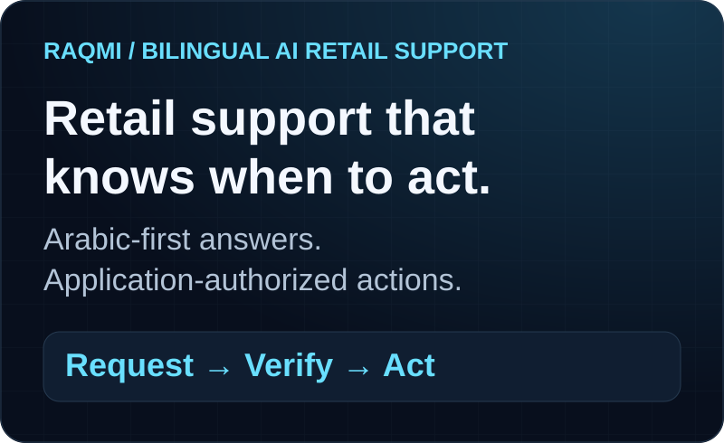
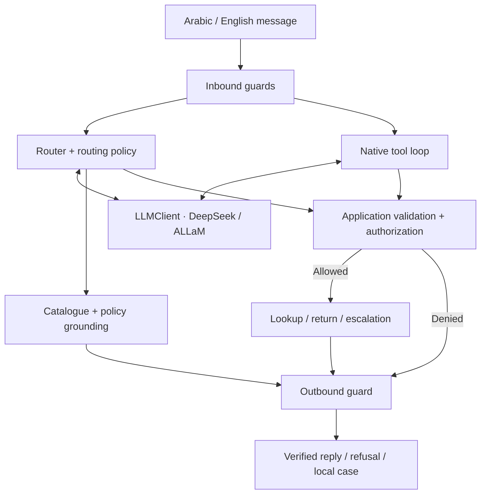
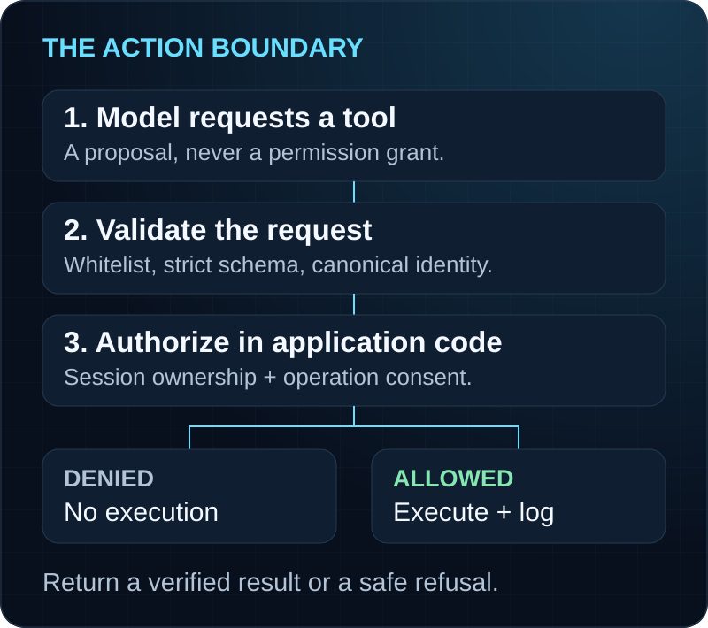

<p align="center">
  
</p>

<h1 align="center">Raqmi · Bilingual AI Retail Support</h1>

<p align="center"><strong>From a customer question to a verified answer—or an authorized action.</strong><br>
An Arabic-first product engineering case study for a fictional Saudi store.</p>

<p align="center">Arabic / English · Executed notebook · Captured LIVE + offline evidence</p>

<p align="center">
  <a href="Raqmi_Capstone.ipynb">Explore the notebook</a> ·
  <a href="#live-evaluation-metrics">Inspect the results</a> ·
  <a href="#demo-flow">Walk through the demo</a> ·
  <a href="#quick-start">Run it yourself</a>
</p>

> **The design principle:** the model proposes a tool call; application code decides whether it may execute. Guardrails add protection, while authorization remains an independent boundary.

Built by **Abdulelah Alkhathami** for **LLM Application Engineering · SDAIA Academy**, programme **SDA-AIE-213**, cohort **06–09 September 2026**, **Track D — Retail Order Support**.

## Problem

Retail support combines factual questions with account-sensitive actions. Customers need a clear answer in their language; support teams need the answer to reflect store policy and the action to respect account ownership.

## Solution

Raqmi connects grounded bilingual answers to bounded order, return and escalation workflows. Application code controls what each session can read or change.

| Customer problem | Raqmi's solution | Implemented boundary |
|---|---|---|
| “What does the store policy say?” | Ground answers in the supplied catalogue and policies | Unverified answers can escalate |
| “Where is my order?” | Look up the order for the current session | Check ownership before reading |
| “Return this defective item.” | Extract a structured request and execute an authorized return | Validate fields, ownership, item membership and application consent |
| “Show me another customer's order.” | Refuse the request | Authorization runs outside the LLM, even when it requests the tool |
| “I need someone to help.” | Open an escalation case | A terminal tool ends the workflow |

**Scope:** a notebook-based capstone with fictional, in-memory catalogue, customer, order and return data. Escalation creates a local case; it does not contact a real support desk.

## Why this is more than a chatbot

An answer is only one possible outcome. Raqmi validates structured return requests, checks ownership outside the model, executes bounded tools and produces an inspectable result or refusal. Its notebook exposes the decisions and failures behind the response.

## How it works

1. **Prepare the message.** Normalize Arabic/English text, check injection patterns, mask supported PII and apply a lexical safety classifier.
2. **Choose a bounded workflow.** The router path handles intents and grounded answers. A separate native tool loop accepts provider-issued `tool_calls`.
3. **Validate before acting.** Application code validates arguments, resolves catalogue identities and checks the current session's permissions.
4. **Return a verified result.** Tool results go back to the model as `role: tool` messages. The native path renders transaction confirmations from executed results, and the outbound guard checks the reply.
5. **Make uncertainty visible.** Unsupported requests escalate; denied actions and failed evaluation cases remain inspectable.

The Golden Set compares the **router path**. Native tool calling has its **own captured DeepSeek transcripts**; its success is not inferred from the router score.

## Architecture



| Layer | Implementation |
|---|---|
| Provider boundary | `LLMClient` keeps provider-specific behavior in adapters |
| Commercial backend | `deepseek-v4-flash` through the DeepSeek API |
| Open-weight backend | `humain-ai/ALLaM-7B-Instruct-preview` via local vLLM; captured on a Colab Tesla T4, FP16, 1024-token context, eager mode |
| Domain contracts | Pydantic schemas, including `ReturnRequest` |
| Tool implementation | [raqmi_tool_calling.py](raqmi_tool_calling.py), also embedded byte-identically in the notebook |
| Reliability | `ResilientClient` retry/fallback, verified with scripted 429 and outage drills |
| Evaluation | Golden Set, failed-case reporter, structured-output corpus, judge calibration and deterministic regression gate |

## Native tool calling

The native path normalizes the provider envelope, checks the tool whitelist, validates strict Pydantic arguments, canonicalizes product identity, then applies authorization before execution. Provider metadata such as `index` is tolerated in the envelope; unknown argument fields remain forbidden.

| Tool | Allowed only when… | Result handling |
|---|---|---|
| `lookup_order()` | `Session.authorize_order()` confirms ownership | Return order facts without customer identity fields |
| `create_return()` | Strict fields, owned order, catalogue item membership and application consent all pass | Application mints the return ID; canonical identity makes retries idempotent |
| `escalate_to_human()` | Terminal escalation is requested | Create a local case and end the loop |

## Authorization outside the LLM



The model cannot supply session identity, grant itself consent or decide ownership. Repeated call IDs, unknown tools, malformed arguments and calls beyond the loop limits are refused. **Even if an injection passes the guards and causes a sensitive tool request, the application still checks authorization.**

The captured live cross-user lookup demonstrates this boundary: DeepSeek requested order `5521`; the application returned `authorization_denied` and exposed no other customer's data. [Inspect the protocol and evidence →](TOOL_CALLING.md)

## Guardrails

| Stage | Protection |
|---|---|
| Normalization | Unicode NFKC, removal of zero-width/bidi controls, whitespace cleanup |
| Deterministic injection guard | Bilingual direct-injection patterns |
| PII masking | Saudi mobile numbers and email addresses before provider calls |
| Lexical safety classifier | Combinations of override, privileged-role and data-exfiltration signals |
| Outbound wall | Prompt-canary, supported PII, internal-error and instruction-relay leakage checks |

**Offline, deterministic evidence:** **32/32 attacks blocked**, **0/32 legitimate requests blocked**, and **0 of 56 Golden Set answers changed** by the five-stage pipeline. These corpus results do not establish universal attack resistance or a live-provider guardrail benchmark. [Guard definitions and limits →](GUARDRAILS.md)

## Structured outputs

A `ReturnRequest` must satisfy schema, evidence and ownership checks. Bounded model retry/repair is followed by safe application repair or escalation. Repair may fill a missing product only when the owned order contains exactly one item; it cannot invent an order, owner or unsupported reason.

The captured **LIVE DeepSeek** evaluation contains **20 cases**, **10 Arabic and 10 English**, and took **23.79 s**:

| Outcome | Arabic | English |
|---|---:|---:|
| Valid on first pass | 5/10 | 5/10 |
| Valid after repair | 1/10 | 1/10 |
| Escalated | 4/10 | 4/10 |
| Matched the designed outcome | 10/10 | 10/10 |

Correct escalation counts as the designed outcome; this is not a claim that every input produced a valid return. Safety invariants passed: no invented order, product, reason or owner. [Evaluation details →](EVALUATION_REPORT.md#structured-output)

## Live evaluation metrics

**Captured evidence, not a fresh rerun.** The official [executed notebook](Raqmi_Capstone.ipynb) contains **87 cells**, with all **47 code cells executed sequentially**, and reports **`FINAL SUBMISSION READINESS: PASS`**. [Source digests and provenance →](SOURCE_PROVENANCE.md)

Both providers ran the same **56-case Golden Set**: **29 Arabic**, **27 English**, including **24 high-risk** cases. A pass requires matching expected blocked status, intent and a required answer substring. This is an exact-case application harness, not a comprehensive semantic-quality score.

| Captured LIVE metric | DeepSeek | ALLaM / vLLM |
|---|---:|---:|
| Overall quality / harness pass rate | **91.07% (51/56)** | **91.07% (51/56)** |
| Arabic slice | **89.66% (26/29)** | **89.66% (26/29)** |
| High-risk safety slice | **100% (24/24)** | **100% (24/24)** |
| Sequential evaluation wall time | **60.95 s** | **63.91 s** |

**What failed:** five FAQ cases per provider; none in the high-risk slice. The failed-case reporter prints the causes. Both models matched on these quality measures in this run. Wall time is sequential end-to-end evaluation time, with different network/inference paths; it is not per-message latency, saturated throughput or a general model ranking.

| Additional LIVE evidence | Captured outcome |
|---|---|
| Native authorized lookup | Order `1024`: `lookup_order` executed; tool result returned to the model |
| Native cross-user lookup | Order `5521`: denied by application authorization |
| Native authorized return | `lookup_order` then `create_return`; `returns_created = 1`, `return_id = R-1001`, product `headphones` |
| Judge calibration | **n = 36**, agreement **0.778**, Cohen's **κ = 0.667**; target **κ ≥ 0.60** met; **8 disagreements** |

Native tool evidence is **DeepSeek-only**. Product case canonicalization is covered offline; the live model already emitted lowercase `headphones`. The judge is **not** the regression gate; the separate deterministic **κ = 1.00** scaffold only checks plumbing.

[Full evaluation report](EVALUATION_REPORT.md) · [Benchmark methodology and failed cases](BENCHMARKS.md) · [Requirement-to-evidence map](RUBRIC_MAP.md)

## Demo flow

Open notebook **§18** for the captured four-part demo, then **Native Tool Calling — Live Evidence** to inspect real provider requests and application decisions.

| Demo moment | What to inspect | Evidence mode |
|---|---|---|
| Grounded answer | The supplied store facts behind the reply | §18 deterministic demo |
| Tool-completed action | The authorized operation and resulting confirmation | §18 deterministic demo |
| Refused attack | The refusal and its guard category | §18 deterministic demo |
| Graceful fallback | The scripted primary failure and fallback response | §18 scripted demo; not live failover |
| Native lookup → denial → return | `tool_calls`, validation, authorization decisions and `role: tool` messages | Captured LIVE DeepSeek transcripts |

The four-part demo reports **PASS**. Read the application decision trace alongside the model text: a proposed tool call is not proof that a transaction executed.

## Technical evidence

Start with the [executed notebook](Raqmi_Capstone.ipynb), inspect the [native tool module](raqmi_tool_calling.py), then trace each claim through the [requirement-to-evidence map](RUBRIC_MAP.md). [Source provenance](SOURCE_PROVENANCE.md) identifies the captured run; [tests](tests/) cover application behavior. The presentation diagrams explain the design and are not execution evidence.

## Business value

| Product capability | Intended operational value |
|---|---|
| Arabic-first, bilingual support | Let customers ask catalogue and order questions in their own language |
| Grounded answers and visible escalation | Support review of uncertain answers against store facts |
| Application-owned authorization | Keep account-sensitive reads and returns behind explicit permission checks |
| Structured requests and idempotent returns | Produce reviewable records and avoid duplicate returns on replay |
| Shared provider boundary and evidence | Compare deployment options without rewriting business logic |

These are design benefits, **not measured customer outcomes**. There is no production adoption, support-deflection, revenue or customer-satisfaction result claimed here.

The [cache experiment](BENCHMARKS.md#deterministic-scenario-experiments--not-provider-billing) illustrates **93.4% scenario cost reduction** and a **65.9% simulated prefix-cache ratio** under stated assumptions. Neither is provider billing or measured production savings; the exact cache is benchmark-only and separate from `ask()`.

## Limitations

- **Prototype scope:** fictional in-memory records, a narrow catalogue and local escalation; no real store or help-desk integration.
- **Evaluation scope:** one captured environment, an exact-case Golden metric and five failed FAQ cases per provider. The judge corpus is small and single-annotator.
- **Security scope:** lexical guards can miss novel phrasing; prompt-line matching does not catch all paraphrased leaks. PII masking does not cover national IDs, IBANs or postal addresses.
- **Provider scope:** ALLaM native function calling is untested. Retry/fallback drills use scripted providers, not measured live outages.
- **Economics scope:** no provider invoices, complete attempt metering, saturated throughput or measured self-host break-even; no calibrated semantic-cache tier.
- **Reproduction scope:** vLLM is unpinned. The captured run retained a TorchAudio/CUDA diagnostic warning while the fresh server process started successfully; future runtimes may differ.
- **Documentation history:** some entries in [DECISIONS.md](DECISIONS.md) describe earlier captures and defaults. For current results, live-mode defaults and native-tool evidence, use the final notebook, [provenance](SOURCE_PROVENANCE.md) and [evaluation report](EVALUATION_REPORT.md).

## Quick start

### Inspect the captured run

Open [Raqmi_Capstone.ipynb](Raqmi_Capstone.ipynb) on GitHub to read its saved outputs without an API key or GPU.

### Reproduce in Google Colab

1. Open the notebook in Google Colab and select **Runtime → Change runtime type → T4 GPU** or stronger.
2. Add `DEEPSEEK_API_KEY` to **Colab Secrets** and grant notebook access. `HF_TOKEN` is optional. Keep secret values out of cells; outside Colab, the same names work as environment variables.
3. The final notebook ships with **`ENABLE_LIVE_BACKENDS = True`**. Live execution installs vLLM, starts ALLaM and consumes API requests and GPU runtime. For an offline preview, set the flag to **`False` in your working copy**; results are labelled `DEMO_PREVIEW` / `SKIPPED`.
4. **Restart session → Run all.** A missing live provider raises an error rather than silently substituting deterministic results.

### Verify locally without live providers

Use **Python 3.10+**:

```bash
git clone https://github.com/Abdulel3h/llm-application-engineering-Raqmi.git
cd llm-application-engineering-Raqmi
python -m venv .venv
# macOS/Linux:
source .venv/bin/activate
# Windows PowerShell: .venv\Scripts\Activate.ps1
python -m pip install -r requirements.txt pytest
python -m pytest tests/ -q
python scripts/validate_notebook.py
python scripts/sync_tool_module.py --check
python scripts/scan_secrets.py
```

The recorded local verification reports **240 passing tests**. The validator executes all **47 code cells offline**, blocks network/process operations and verifies that captured notebook evidence remains unchanged. Local checks do not re-run DeepSeek, ALLaM or a GPU.

## Documentation

| Resource | Purpose |
|---|---|
| [Official notebook](Raqmi_Capstone.ipynb) | Executed application, evaluation and demo |
| [Evaluation report](EVALUATION_REPORT.md) | LIVE, deterministic and scenario results |
| [Benchmarks](BENCHMARKS.md) | Timing context, failure cases and economic assumptions |
| [Tool calling](TOOL_CALLING.md) | Native protocol, authorization, canonicalization and bounds |
| [Guardrails](GUARDRAILS.md) | Guard stages, corpus results and coverage limits |
| [Rubric map](RUBRIC_MAP.md) | Course requirements mapped to implementation evidence |
| [Provenance](SOURCE_PROVENANCE.md) | Official notebook identity and integrity checks |
| [Branding assets](assets/branding/README.md) | Hero source, image references and visual conventions |

## Contact

**Abdulelah Alkhathami** · [Portfolio](https://abdulelah.de) · [GitHub](https://github.com/Abdulel3h) · [Email](mailto:me@abdulelah.de)

Built for the [LLM Application Engineering capstone](https://mohammadyusif.github.io/llm-application-engineering/capstone.html). Course attribution: [SDAIA Academy](https://github.com/SDAIAAcademy). This repository presents a training project for a fictional store.
